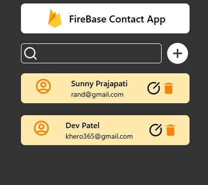

# Firebase Contact App

A simple React-based contact management application integrated with Firebase for real-time data storage and updates. This app allows users to add, search, update, and delete contact information.

## Main Interface Preview


## Features
- 🆕 **Add Contact**: Add a new contact with a name and email.
- 🔍 **Search Contacts**: Search through the list of saved contacts in real-time.
- ✏️ **Update Contact**: Edit an existing contact's details.
- 🗑️ **Delete Contact**: Remove a contact from the list.
- 🌐 **Real-time Database**: All contact data is stored and updated in real-time using Firebase.

## Setup and Installation

### Prerequisites
- ✅ Node.js installed on your machine.
- ✅ Firebase account and project set up.

### Steps
1. **Clone the repository:**
   ```bash
   git clone https://github.com/your-username/firebase-contact-app.git
   cd firebase-contact-app
   ```

2. **Install dependencies:**
   ```bash
   npm install
   ```

3. **Set up Firebase:**
   - Go to the Firebase Console and create a new project.
   - Enable the Realtime Database.
   - Add a new Web App to your Firebase project and copy the configuration.
   - Create a `firebaseConfig.js` file in the `src` folder and paste the configuration:
     ```javascript
     import { initializeApp } from "firebase/app";
     import { getDatabase } from "firebase/database";

     const firebaseConfig = {
       apiKey: "<your-api-key>",
       authDomain: "<your-auth-domain>",
       databaseURL: "<your-database-url>",
       projectId: "<your-project-id>",
       storageBucket: "<your-storage-bucket>",
       messagingSenderId: "<your-messaging-sender-id>",
       appId: "<your-app-id>"
     };

     const app = initializeApp(firebaseConfig);
     export const db = getDatabase(app);
     ```

4. **Run the application:**
   ```bash
   npm start
   ```
   Open your browser and navigate to `http://localhost:3000` to view the app.

## Dependencies
- ⚛️ React
- 🔥 Firebase
- 🎨 Tailwind CSS (for styling)

## License
This project is licensed under the MIT License. Feel free to use and modify it.

## Acknowledgments
- 🙏 Firebase for providing the real-time database.
- 🙌 React for the front-end framework.

## Contribution
Contributions are welcome! Please open an issue or submit a pull request for any changes or improvements.

---
Happy coding! 🎉
